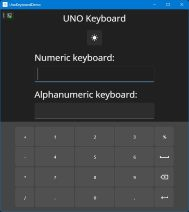

# UnoKeyboard

UnoKeyboard is an on-screen virtual keyboard designed for Desktop, WASM, and Windows platforms.

  

## Features

- Multi-platform support.
- Customizable layout.
- Theme support.
- Customizable appearance (font and size).

## Usage

This library provides an extension method for the `Window` class to display the virtual keyboard. 

The method generates a scaffold with the keyboard layout and adds it to the `Window` content. You can then use the new RootFrame to publish your actual content.

To activate the main window, add the following line to your `App.xaml.cs` file. The control manages focus events using FocusManager, so the keyboard will be shown whenever any TextBox control gets the focus.

```csharp
// Once the keyboard is added to the window, users should use RootFrame to add new content.
public static Frame RootFrame => McWindowEx.RootFrame;

MainWindow.AddKeyboard(height: 300);

// Navigate using McWindowEx.RootFrame
if (RootFrame.Content == null)
{
    RootFrame.Navigate(typeof(MainPage), args.Arguments);
}
```

The extension class `McWindowEx` introduces a new attached property `KeyboardType` that allows keyboard customization. Two default keyboards are provided:

- en-alfa
- numeric

To use a specific keyboard, set the attached property `KeyboardType` in your TextBox control. By default, the keyboard is set to `en-alfa`:

```xml
<Page 
    xmlns:mck="using:UnoKeyboard" />

<TextBox Width="200"
         VerticalAlignment="Center"
         FontSize="30"
         mck:McWindowEx.KeyboardType="numeric" />
```

## Customization

Two static dictionaries are used to define the Keyyboard and the Keys. You can add more keys and keyboard layouts by adding new entries to these dictionaries.

### VirtualKeys

[VirtualKeys.Key](src/UnoKeyboard/VirtualKeys.cs) dictionary defines the keys that will be displayed on the keyboard. Each key is defined by a [VirtualKeyModel](src/UnoKeyboard/Models/VirtualKeyModel.cs).

That is a reduced version of the dictionary:

```csharp
public static class VirtualKeys
{
    public static Dictionary<string, VirtualKeyModel> Key = new()
    {
        { "N1", new VirtualKeyModel("N1", KeyType.Text, "1", "1", 0x0031, 0x0031, null, 0, 0) },
        { "N2", new VirtualKeyModel("N2", KeyType.Text, "2", "2", 0x0032, 0x0032, null, 0, 0) },
    }
}
```

Now let say you want to add the key `|` to your own keyboard layout:

```csharp
VirtualKeys.Key.Add("|",                // Dictionary key
    new VirtualKeyModel("|",            // Key Id
                        KeyType.Text,   // Type
                        "|",            // Upper Case
                        "|",            // Lower Case
                        0x007C,         // Upper Case Unicode
                        0x007C,         // Lower Case Unicode
                        null,           // PathGeometry for special keys
                        0,              // Width of geometry path.
                        0));            // Height of geometry path.
```

### Keyboards

The [Keyboards.Keyboard](src/UnoKeyboard/Keyboards.cs) dictionary defines the keyboard layouts. Each keyboard is defined by a [KeyboardModel](src/UnoKeyboard/Models/KeyboardModel.cs).

Lets add the new key to the keyboard layout:

```csharp
Keyboards.Keyboard.Add("my_keyboard",   // Dictionary key
    new KeyboardModel("my_keyboard"     // Keyboard Id
                      "1",              // Number of pages.
                      "3",              // Number of rows.
                      "10",             // Max. keys per row.
                      [
                        new KeyModel(0,                     // Page 0
                                     0,                     // Row 0
                                     1,                     // Column 1
                                     1,                     // Column span
                                     VirtualKeys.Get("|")), // Key
                      ]));
```

### Automatic Keyboard Appearance and Disappearance

The on-screen keyboard automatically appears whenever a TextBox gains focus and disappears when it loses focus. This behavior is controlled by the `HandleFocusManager` property of the keyboard control.

How it works:

When HandleFocusManager is set to true, the keyboard control actively monitors the focus state of elements within your application. As soon as a TextBox receives focus, the keyboard is automatically displayed to facilitate user input. Conversely, when the focus shifts to another element, the keyboard gracefully disappears, providing a clean and uncluttered interface.